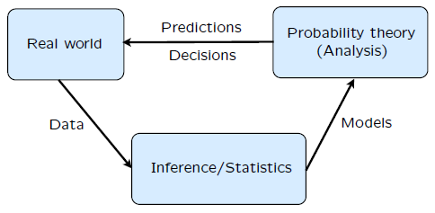

### Lecture 1: Probability Models and Axioms

* [Overview](https://www.youtube.com/watch?v=1opb8hQz7GQ)

* [Sample Space](https://www.youtube.com/watch?v=qFBSUg59bWg)
  *Omega: Set of possible outcomes that are:
    * Mutually exclusive.
    * Collectively exhaustive.
    * At the _right_ granularity.

* [Sample Space Examples](https://www.youtube.com/watch?v=iUF5n3Ou7Sc)
  * Examples of discrete and continuous sample spaces.

* [Probability Axioms](https://www.youtube.com/watch?v=2J5Vr-kB_c4)
  * Event: A subset of the sample space.
  * Axioms:
    * Non-negativity: P(A) >= 0.
    * Normalization: P(Omega) = 1.
    * Additivity: P(AUB) = P(A) + P(B) - P(AnB). (This gives us the union bound: P(AUB) <= P(A) + P(B)

* [Simple Properties of Probabilities](https://www.youtube.com/watch?v=VgYkGzp_3jk)

* [More Properties of Probabilities](https://www.youtube.com/watch?v=3gV4LWWhWwo)
 
* [A Discreet Example](https://www.youtube.com/watch?v=MqHBUGcvpGI)

* [A Continuous Example](https://www.youtube.com/watch?v=sT3xw1TZ7oU)

* [Countable Additivity](https://www.youtube.com/watch?v=oGePTQ6hFFI)
 > Countable Additivity Axiom:  
If A1, A2, A3... is an infinite sequence of disjoint events, then P(A1 U A2 U ...) = P(A1) + P(A2) + ...

* [Interpretation and Uses of Probability](https://www.youtube.com/watch?v=XsUNKLd7N5Y)  
 
 

[Back to course notes](../Course_Notes.md)

