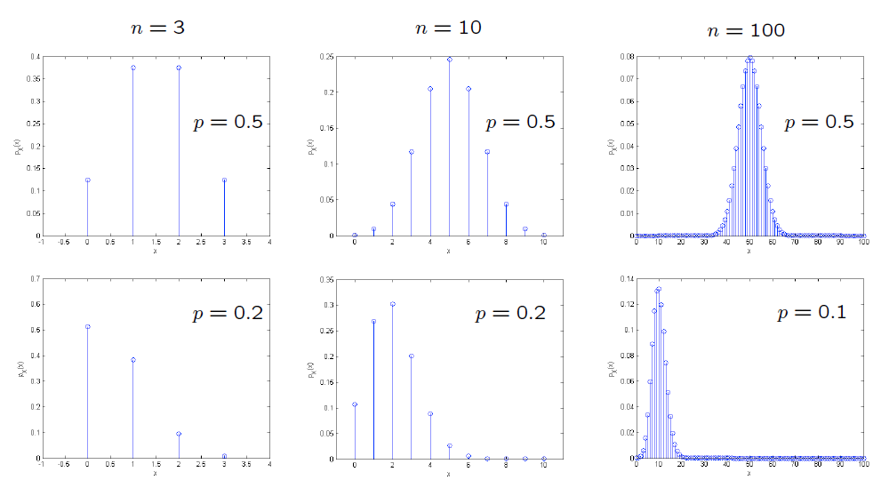

### Lecture 5: Probability Mass Functions and Expectations

* Overview

* [Definition of Random Variables](https://www.youtube.com/watch?v=l2f743SpPiw)
  * A random variable (r.v.) associates a value ( a number) to every possible outcome.
  * Mathematically: A function from the sample space Omega to real numbers.
  * A r.v. can take discrete or continuous values.
  * Notation: Random variable (a function) X, numerical value x.
  * We can have several r.v's defined on the same sample space.
  * A function of one or several random variables is also a random variable.

* [Probability Mass Function](https://www.youtube.com/watch?v=La49EMG5Ar4)
  * Also called "probability law" or "probability distribution" of X.
  * P_X (x) = P(X=x) = P({w e omega s.t. X(w) = x}).
  * Properties: P_X (x) >= 0 and Sum_x P_X (x) = 1.

* [Bernoulli and Indicator Random Variables](https://www.youtube.com/watch?v=vokziIl_3Eo)
  * The simplest kind of r.v.
  * A Bernoulli r.v. with parameter p e [0,1]:
    * X = 1 w.p. p; = 0 w.p. (1-p).
  * It models a trial with success/ failure, heads / tails, etc.
  * Indicator r.v. of event A: I_A = 1 iff A occurs. i.e. P_(I_A) (1) = P(I_A = 1) = P(A).

* [Uniform Random Variables](https://www.youtube.com/watch?v=_fwDUx5JpH8)
 * Parameters: Integers a,b; a <=b.
 * Experiment: Pick any one of a, a+1, ... b; All equally likely.
 * Random Variable X: X(w) = w. P_X (x) = 1/(b-a+1).
 * Model of: Complete ignorance.
 * Special Case: a=b; constant / deterministic r.v. with probability 1.

* [Binomial Random Variables](https://www.youtube.com/watch?v=TRsSsOruga4)
 * Parameters: Positive integer n, p e [0,1]
 * Experiment: n independent tosses of a coin with P(heads) = p.
 * Sample Space: Set of sequences of H and T, of length n.
 * Random Variable: X: Number of heads observed. P_X (k) = nCk p^k (1-p)^(n-k)
 * Model of: Number of successes in a given number of independent trials.
 * Examples:  
 

* [Geometric Random Variables](https://www.youtube.com/watch?v=PtUpe1Vj264)
 * Parameters: 0 < p <=1
 * Experiment: Infinitely many independent tosses of a coin with P(heads) = p.
 * Sample Space: Set of infinite sequences of H and T.
 * Random Variable: X: Number of tosses until first heads. P_X (k) = (1-p)^(k-1) * p^k.
 * Model of: Waiting times; number of trials until success.
 * Probability of no-heads ever = 0.

* [Expectation](https://www.youtube.com/watch?v=Eih56jZ3bcA)
 * Expectation / mean of a random variable is defined as: E(X) = Sum_x x * P_X (x).
 * Intepretation: Average in a large number of independent repetitions of the experiment.
 * Expectation of:
  * Bernoulli r.v. = p
  * Indicator I_A = P(A)
  * Uniform r.v. = (a + b)/2
  * In general: Center of gravity of the pmf.
 * Alternate interpretation: Average of a r.v. over a particular population.

* [Elementary Properties of Expectations](https://www.youtube.com/watch?v=wCvxYC_RgI8)
 * If X >= 0 then E[X] >= 0.
 * If a <= X <= b then a <= E[X] <= b.
 * If c = constant, then E[c] = c.

* [The Expected Value Rule](https://www.youtube.com/watch?v=Xa9tPXx8SSk)
 * Let X be a r.v. and Y = g(X), then E[Y] = Sum_x g(x) * P_X (x).
 * Caution: In general, E[g(X)] != g(E[X]).

* [Linearity of Expectations](https://www.youtube.com/watch?v=jmV3UFDJRYc)
 * E[aX + b] = a*E[X] + b

 

[Back to course notes](../Course_Notes.md)
