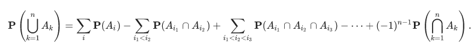

### Additional Theoretical Material

* [Functions](https://www.youtube.com/watch?v=F12MUsgpFA0)

* [The Variance of the Geometric pmf](https://www.youtube.com/watch?v=kn7aL4zwROY)
  * Variance of geometric r.v. = (1-p)/p^2.

* [The Inclusion-Exclusion Formula](https://www.youtube.com/watch?v=f1GYgMLzdHE)  
  

* [Independence of r.v.'s versus Independence of Events](https://www.youtube.com/watch?v=MmkSu3GRd2Q)
  * Indicator events corresponding to events are independent if and only if the events are independent.

* Solved Problems:
