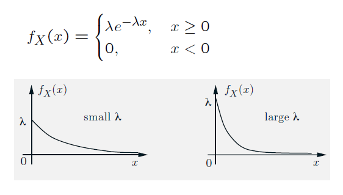

### Lecture 8: Probability Density Functions

* [Overview](https://www.youtube.com/watch?v=NVQsY04z3Us)

* [PDFs](https://www.youtube.com/watch?v=XqHGmCC_NXk)
  * PDF represented as f_X (x) and is the probability per unit length (or area).
  * P(a<=X<=b) = Int_a^b f_X (x) dx.
  * Conditions for a legitimate pdf: f_X (x) >= 0 and Int_(-Inf)^(+Inf) f_X (x) dx = 1.
  * A random variable is continuous if it can be described by a PDF.
  * f_X (a) = 0. As a consequence, P(a<=X<=b) = a<X<b).

* [Uniform and Piecewise Constant PDFs](https://www.youtube.com/watch?v=BxFLB3ehpQo)
  * The PDF can be piecewise continuous (discontinuities are allowed).
  * For a single interval from a to b, the height of the PDF is 1/(b-a).
  * For multiple (discontinuous) segments, the area under the curve should still add to 1 for the PDF to be valid.

* [Means and Variances](https://www.youtube.com/watch?v=VMoi5b93vHs)
  * Expectation/mean of a continuous r.v. E[X] = Int_(-Inf)^(+Inf) x * f_X (x) dx.
  * Can think of it as the center of gravity of the distribution (similar to the descrete case).
  * Properties of expectation of a continuous r.v.:
    * If X>=0, E[X]>=0.
    * If a<=X<=b then a<=E[X]<=b.
    * Expected value rule: E[g(X)] = Int_(-Inf)^(+Inf) g(x) * f_X (x) dx.
    * Linearity: E[aX+b] = a * E[X] + b.
  * Properties of variance of a continuous r.v.:
    * Variance = E[(x-mu)^2] {where mu = E[X]} = Int_(-Inf)^(+Inf) (x-mu)^2 * f_X (x) dx.
    * Std Dev sigma(X) = sqrt(var(X)).
    * Var(aX + b) = a^2 * var(X).
    * Var(X) = E[X^2] - (E[X])^2.

* [Mean and Variance of Uniform PDF](https://www.youtube.com/watch?v=76PIh08l5RY)
  * For the discrete case we had E[X] = (a+b)/2 and Var[X] = (b-a)(b-a+2)/12.
  * For the continuous case we have E[X] = (a+b)/2 and Var[X] = (b-a)^2 /12 and Sig(X) = (b-a)/sqrt(12).

* [Exponential Random Variables](https://www.youtube.com/watch?v=ReNhZAtZfVA)  
  
  * Has similarity to geometric r.v.
  * E[X] = 1/lambda; E{X^2] = 2/lambda^2; var(X) = 1/lambda^2.
  * P(X>=a) = exp(-lambda * a).
  * In the discrete case, a geometric r.v. models time until first success.
  In the continuous case, an exponential r.v. can be used to model:
    * the time until a customer arrives.
    * the time until a light bulb burns out.
    * the time until a machine breaks down.
    * the time until an email arrives.

* [Cumulative Distribution Function (CDF)](https://www.youtube.com/watch?v=uKmS9pPCPBo)
 * Definiton: F_X(x) = P(X<=x) = Int_(-Inf)^(x)  f_X (t) dt.
 * d/dx F_X(x) = f_X(x) - Thus we can obtain the CDF from the PDF and vice versa.
 * For the discrete uniform case, the CDF takes the form of a staircase with jumps proportional to the probability at specific points.
 Note that at the jump, the value of the CDF will be the higher value by the definition of CDF.
 * General properties of a CDF:
  * It is a non-decreasing function.
  * F_X (x) -> 1 as x -> Inf.
  * F_X (x) -> 0 as x -> -Inf.

* [Normal (Gaussian) Random Variables](https://www.youtube.com/watch?v=Xry1IaoIyLI)
 * Good model of noise when it is due to many small independent noise terms.
 * Standard normal random variable with mean 0 and variance of 1,indicated by N(0,1):  
 f_X(x) = 1/sqrt(2*pi) exp(-x^2 / 2).
 * Genral normal random variable with mean mu and variance of sigma^2,indicated by N(mu, sigma^2):  
 f_X(x) = 1/(sigma * sqrt(2 * pi)) exp(-(x-mu)^2 / (2 * sigma^2 )).
 * Linear functions of normal r.v.'s are also a r.v.  
 i.e. if X ~ N(mu, sigma^2) and Y = a * X + b, then Y ~ N(a * mu + b, a^2 * sigma^2).

* [Calculation of Normal Probabilities](https://www.youtube.com/watch?v=l9HnIKtFYi0)
 * There is no closed form available for the CDF of a standard normal distribution (represented as phi(x)). So we have a [table](../Images/08/normal_table.png) to look up the value.
 * For a negative x, by symmetry we have phi(-x) = 1 - phi(x).
 * For a general normal r.v., convert the variable first to a standard normal r.v. using the transformation (x - mu)/sigma,
 and then use this variable to calculate the probabilities.

 

[Back to course notes](../Course_Notes.md)
