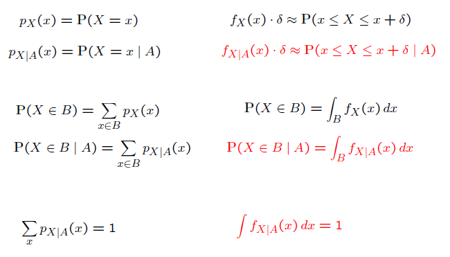
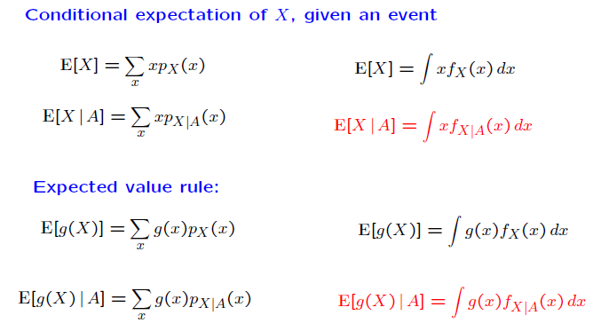

### Lecture 9: Conditioning on an Event; Multiple r.v.'s

* [Overview](https://www.youtube.com/watch?v=lEtn24ZNAKE)

* [Conditioning a Continuous Random Variable on an Event](https://www.youtube.com/watch?v=ajki07PRbGU)
  * Some formulae:  
    
  * Conditional PDF of X, given X e A:  
  f_X|XeA (x) = 0 if x !e A; = f_X (x) / P(A) if x e A.
  * Conditional expectations and expected value rule:
  

* [Conditioning Example](https://www.youtube.com/watch?v=tEpbQb7ZhzI)

* [Memorylessness of the Exponential PDF](https://www.youtube.com/watch?v=sL92ai-DfJw)

* [Total Probability and Expectation Theorems](https://www.youtube.com/watch?v=NEkDb1RmqYY)
  * Total Probability Theorem:  
  f_X (x) = P(A_1) * f_X|A_1 (x) + ... + P(A_n) * f_X|A_n (x).
  * Total Expectation Theorem:  
  E[X] = P(A_1) * E[X|A_1] + ... + P(A_n) * E[X|A_n]

* [Mixed Random Variables](https://www.youtube.com/watch?v=965d38Vv7zw)
  * Mixed r.v.'s are those that are partly represented as a discrete r.v. and partly as a continuous r.v.
  * Mixed r.v.'s can be described by their CDF and 
  use the total probability and total expectation theorems to calculate probabilities and expectations.

* [Joint PDFs](https://www.youtube.com/watch?v=o6IiZV6Rv-Y)
  * Two r.v.'s are jointly continuous if they can be described by a joint PDF.
  * The joint PDF represents a probability density i.e. probability per unit area.
  * Probability for any line or point for jointly continuous r.v's is zero.

* [From the Joint to the Marginal](https://www.youtube.com/watch?v=YKsrbQRv3VE)
  * Marginal PDFs can be recovered from the joint PDF by integrating along the other r.v.
   E.g. f_X (x) = Int f_(X,Y) (x,y) dy.

* [Continuous Analogues of Various Properties](https://www.youtube.com/watch?v=_s3pBOucvmY)

* [Joint CDFs](https://www.youtube.com/watch?v=Awnieu-7jpg)
  * The joint PDF can be recovered from the joint CDF by taking a derivative of the CDF along each variable.
  
 

[Back to course notes](../Course_Notes.md)
