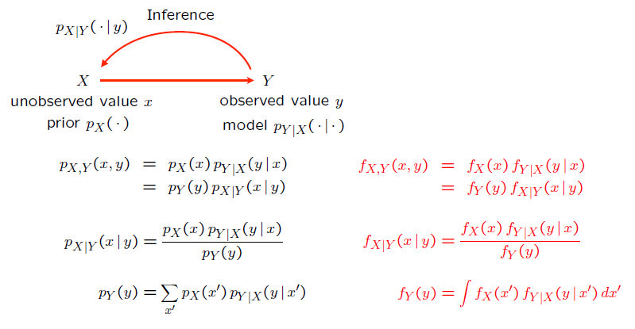
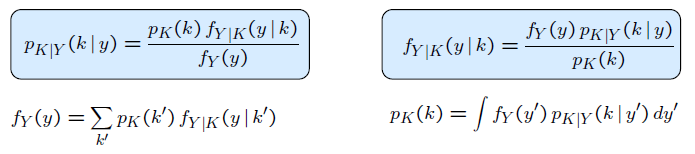

### Lecture 10: Conditioning on a Random Variable; Independence; Bayes' Rule

* [Overview](https://www.youtube.com/watch?v=-tmWnURDHAs)

* [Conditional PDFs](https://www.youtube.com/watch?v=1Iy_U7vhHZk)
  * f_(X|Y) (x|y) = f_(X,Y) (x,y) / f_Y (y)  { if f_Y (y) > 0.

* [Comments on Conditional PDFs](https://www.youtube.com/watch?v=CK4KNSYbTmA)
  * f_(X|Y) (x|y) >= 0.
  * Int_(-Inf)^(Inf) f_(X|Y) (x|y) dx = 1.
  * Multiplication rule: f_(X,Y) (x,y) = F_Y (y) * f_(X|Y) (x|y)

* [Total Probability and Total Expectation Theorems](https://www.youtube.com/watch?v=gSh395Ista4)  
  

* [Independence](https://www.youtube.com/watch?v=UEQR1HQsGsY)
  * For independence, we have: f_(X,Y) (x,y) = f_X (x) * f_Y (y) for all x and y.
  * This is equivalent to f_(X|Y) (x|y) = f_X (x) for all y.
  * Additional properties:
    * E[X * Y] = E[X] * E[Y]
    * var(X + Y) = var(X) + var(Y)
    * E[g(X) * h(Y)] = E[g(X)] * E[h(Y)]

* [Stick Breaking Example](https://www.youtube.com/watch?v=3IJfrT6qVLA)

* [Independent Normals](https://www.youtube.com/watch?v=zLx8721gYek)

* [Bayes' Rule Variations](https://www.youtube.com/watch?v=ZHnvjcn6D-0)  
  

* [Mixed Bayes Rule](https://www.youtube.com/watch?v=SMKiXsEY2ZY)
 * Bayes' Rule with one discrete and one random variable:  
  

* [Example: Detection of a Binary Signal](https://www.youtube.com/watch?v=AiXmkA0Cj1I)

* [Inference of the Bias of a Coin](https://www.youtube.com/watch?v=KeNyYl3xzvs)

* Solved Problems:
 * [Calculating a CDF](https://www.youtube.com/watch?v=V5vkgEXockw)
 * [Mixed Distribution Example](https://www.youtube.com/watch?v=biD2JUY-DC0)
 * [Mean and Variance of the Exponential](https://www.youtube.com/watch?v=2HseHAVCJjM)
 * [Normal Probability Calculation](https://www.youtube.com/watch?v=Hy6EGOzvlvI)
 * [Densities and Conditioning on an Event](https://www.youtube.com/watch?v=_i4pVQmJ1rk)
 * [Circular Uniform PDF](https://www.youtube.com/watch?v=4SPpgdWnArc)
 * [The Absent Minded Professor](https://www.youtube.com/watch?v=1872CEK5RqY).
 * [Uniform Probabilities on a Triangle](https://www.youtube.com/watch?v=spJbyL0bDpk)
 * [Probability that 3 Pieces form a Triangle](https://www.youtube.com/watch?v=NYMKMmIrgMk)
 * [Buffon's Needle and Monte Carlo Simulation](https://www.youtube.com/watch?v=Hyh_uQX4dFk)
 * [Bayes' Rule with Continuous Random Variables](https://www.youtube.com/watch?v=IGG4IOSt0WA)

 

[Back to course notes](../Course_Notes.md)
