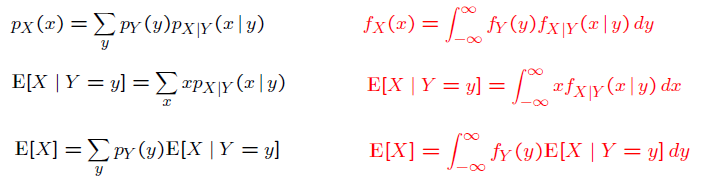

### Lecture 10: Conditioning on a Random Variable; Independence; Bayes' Rule

* [Overview](https://www.youtube.com/watch?v=-tmWnURDHAs)

* [Conditional PDFs](https://www.youtube.com/watch?v=1Iy_U7vhHZk)
  * f_(X|Y) (x|y) = f_(X,Y) (x,y) / f_Y (y)  { if f_Y (y) > 0.

* [Comments on Conditional PDFs](https://www.youtube.com/watch?v=CK4KNSYbTmA)
  * f_(X|Y) (x|y) >= 0.
  * Int_(-Inf)^(Inf) f_(X|Y) (x|y) dx = 1.
  * Multiplication rule: f_(X,Y) (x,y) = F_Y (y) * f_(X|Y) (x|y)

* [Total Probability and Total Expectation Theorems](https://www.youtube.com/watch?v=gSh395Ista4)  
  

* [Independence](https://www.youtube.com/watch?v=UEQR1HQsGsY)
  * For independence, we have: f_(X,Y) (x,y) = f_X (x) * f_Y (y) for all x and y.
  * This is equivalent to f_(X|Y) (x|y) = f_X (x) for all y.
  * Additional properties:
    * E[X * Y] = E[X] * E[Y]
    * var(X + Y) = var(X) + var(Y)
    * E[g(X) * h(Y)] = E[g(X)] * E[h(Y)]

 

[Back to course notes](../Course_Notes.md)
