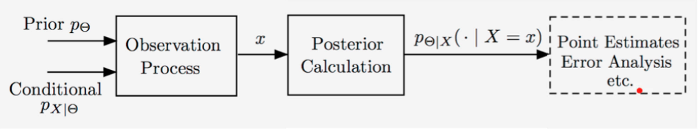

### Lecture 14: Introduction to Bayesian Inference

* [Overview](https://www.youtube.com/watch?v=SQla-a7O-ag)

* [Overview of Some Application Domains](https://www.youtube.com/watch?v=hIPL_UOpNKo)

* [Type of Inference Problems](https://www.youtube.com/watch?v=XwGxj9NnBB0)
  * Difference between model building and inferring unobserved variables.
  * Hypothesis testing:
    * Unknown takes one of few possible values.
    * Aims at a small probability of incorrect decision.
  * Estimation:
    * Numerical unknown(s).
    * Aims at an estimate that is _close_ to the true but unknown value.

* [The Bayesian Inference Framework](https://www.youtube.com/watch?v=1sTuCID988Y)  
  
  * Unknown theta 
    * Treated as a random variable
    * Prior distribution p_theta or f_theta which comes from:
      * Symmetry
      * Known range
      * Prior studies
      * Symmetry or arbitrary
  * Observation X
    * Observation model p_(X|Theta) or f_(X|Theta)
  * Use appropriate version of Bayes' rule to find p_(Theta|X=x) or f_(Theta|X=x).
  This posterior distribution is the complete answer.
  * MAP point estimate: Maximum a posteriori probability:
    * p_(Theta|X) (theta* | x) = max_theta p_(Theta|X) (theta| x) or
    * f_(Theta|X) (theta* | x) = max_theta f_(Theta|X) (theta| x).
  * Point estimate: Conditional expectation:
    * E[Theta|X = x] (LMS Least Mean Squares)
  * Difference between a point estimate and a point estimator.

* [Discrete Parameter, Discrete Observation](https://www.youtube.com/watch?v=D6C9_rUxgOY)
  * Conditional probability of error: 
    * P(theta_hat != Theta | X=x) =sum of probabilities not corresponding to the estimate.
    * Smallest under the MAP rule.
  * Overall probability of error:
    * P(theta_hat != Theta)
    * Can use different versions of the total probability theorem to calcualte the value:
      * sum_x P(theta_hat != Theta | X=x) * p_X (x).
      * P(theta_hat != Theta | Theta = theta) * p_Theta (theta).

* [Discrete Parameter, Continuous Observation](https://www.youtube.com/watch?v=5fN_fkQyvnw)
  * e.g. binary signal corrupted by gaussian noise.

* [Continuous Parameter, Continuous Observation](https://www.youtube.com/watch?v=g1lX6YEaqb8)
  * e.g. combination of independent normals.
  * In the continuous case, we are interested in:
    * E[ (theta_hat - Theta)^2 | X = x] and
    * E[ (theta_hat - Theta)^2 ]

* [Inferring the Unknown Bias of a Coin and the Beta Distribution](https://www.youtube.com/watch?v=RcAwbn4WImk)
  * This is the  continuous parameter, discrete observation case.
  * e.g. n coin tosses of a coin with unknown bias.
  * Beta distribution with parameters (alpha + 1, beta + 1) = 1/c theta^alpha (1 - theta)^beta.
  * Specifically for coin tosses, if H heads and T tails are observed, the PDF is a beta function with parameters (H+1, T+1).

* [Inferring the Unknown Bias of a Coin - Point Estimates](https://www.youtube.com/watch?v=XS33yIOtEew)
  * Starting with a uniform distribution, the MAP estimate when one observes k heads in n tosses is k/n.
  * The LMS estimator in this case is (k+1)/(n+2).
  * Note Int_0^1 x^alpha (1-x)^beta dx = alpha! beta! / (alpha + beta + 1)! (provided alpha>=0 and beta >= 0).

* [Summary](https://www.youtube.com/watch?v=Xj_nEa-JmDQ)

 

[Back to course notes](../Course_Notes.md)
